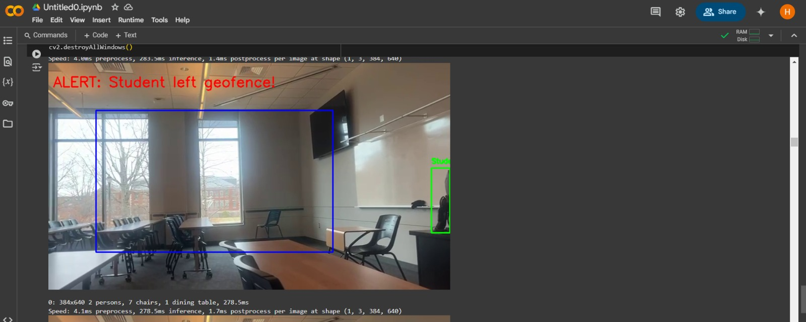

# Geofencing-AI

**A real-time geofencing system using YOLOv8 and OpenCV to track students during recess and alert when they leave a predefined safe area. Built with Flask for the web interface.**

   

## Overview
This project is a real-time geofencing system that tracks students during recess and alerts when they leave a predefined safe area. It uses **YOLOv8** for object detection, **OpenCV** for video processing, and **Flask** for the web interface.

## Features
- Real-time student detection using YOLOv8.
- Geofencing to define safe areas and detect boundary violations.
- Alerts displayed on the video feed when a student leaves the geofence.
- Web interface to visualize the video feed and alerts.

## Tech Stack
- **YOLOv8**: For real-time object detection.
- **OpenCV**: For video processing and drawing bounding boxes.
- **Flask**: For creating the web interface.
- **NumPy**: For defining and checking the geofence polygon.
- **Google Colab**: For testing and running the code.

## Installation
1. Clone the repository:
   ```bash
   git clone https://github.com/your-username/geofencing-project.git
